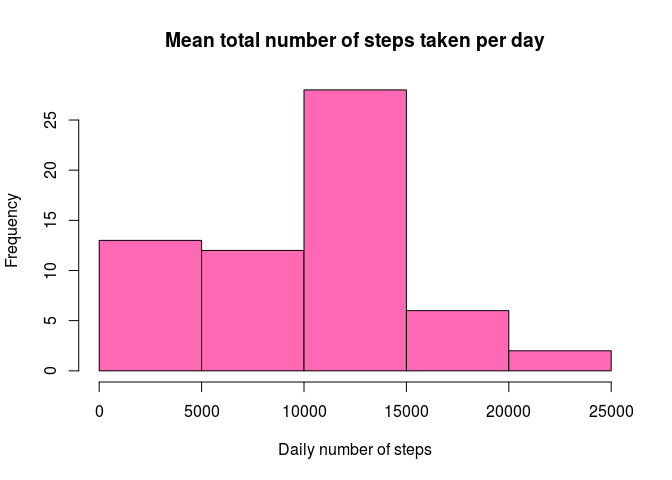
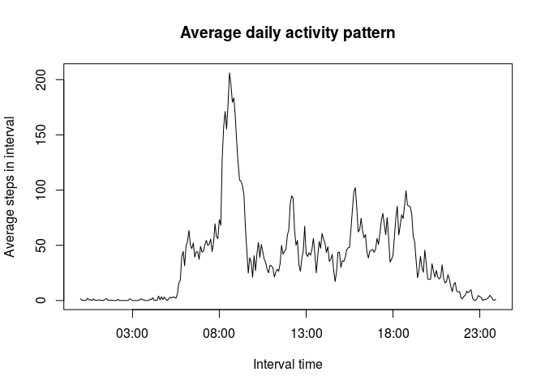
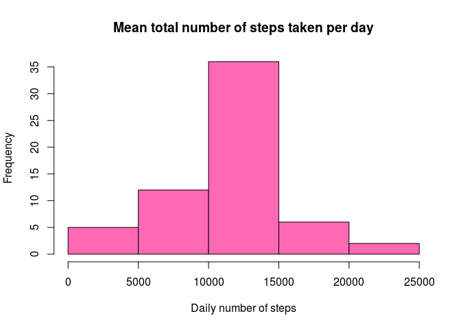
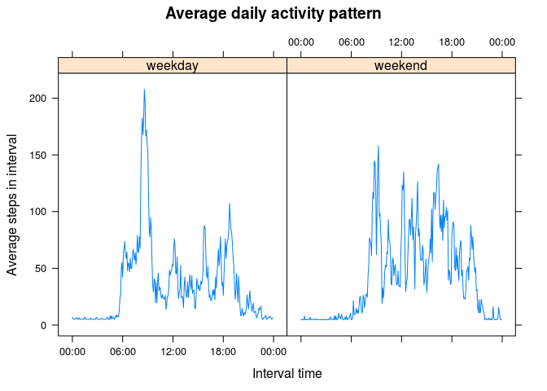

# Reproducible Research: Peer Assessment 1

-----------------------------------------------------------------

## Loading and preprocessing the data

```r
df <- read.csv("activity.csv", sep = ",", header = TRUE)
#helpful time-formatting of intervals
interval_times <- seq(from=as.POSIXct("00:00",format="%H:%M"), to=as.POSIXct("23:55",format="%H:%M"), by=60*5)
```

## What is mean total number of steps taken per day?

```r
#find total, mean, median
total.steps <- tapply(df$steps, df$date, sum, na.rm = TRUE)
mean.steps <- signif(mean(total.steps, na.rm=TRUE),6)
med.steps <- median(total.steps, na.rm=TRUE)

#plot
hist(total.steps, xlab = "Daily number of steps", main = "Mean total number of steps taken per day", col ="HotPink")
```

 

- The mean number of total steps per day is 9354.23.  
- The median number of total steps per day is 10395.  

## What is the average daily activity pattern?


```r
#find max interval
avg.steps.in.interval <- tapply(df$steps, df$interval, mean, na.rm = TRUE)
max.interval = which.max(avg.steps.in.interval)
max.interval.name = names(max.interval)

#plot
plot(y=avg.steps.in.interval, x=interval_times, type="l", xlab = "Interval time", ylab = "Average steps in interval", main = "Average daily activity pattern")
```

 

- The 5-minute interval which contains the maximum average number of steps is the interval at 835. 

## Imputing missing values


```r
num.na <- sum(is.na(df$steps))
```

- The total number of missing values in the dataset is 2304.

We will replace these missing values using the *overall mean number of steps*.


```r
options(scipen=5)

#create new imputed dataset
new.df <- transform(df, steps = ifelse(is.na(steps), mean(steps, na.rm=TRUE), steps))

#find total, mean, median
new.total.steps <- tapply(new.df$steps, new.df$date, sum)
new.mean.steps <- signif(mean(new.total.steps),7)
new.med.steps <- signif(median(new.total.steps),7)

#plot
hist(new.total.steps, xlab = "Daily number of steps", main = "Mean total number of steps taken per day", col ="HotPink")
```

 

- The mean number of total steps per day is 10766.19.  
- The median number of total steps per day is 10766.19  (the same as the mean; this is an artifact of the choice of how to impute missing values)

Imputing missing data led to higher mean and medians, as well as a histogram which is more peaked about this mean (since we added a whole bunch of new values exactly at the overall mean). 

## Are there differences in activity patterns between weekdays and weekends?


```r
#assign weekend or weekday to dates
new.df$daytype <- factor(ifelse(weekdays(as.POSIXct(new.df$date)) == "Sunday" | weekdays(as.POSIXct(new.df$date)) =="Saturday", "weekend", "weekday"))

#lattice plot insists on including (placeholder) dates, so need to strip them out
library(chron)
interval_times <- times(format(interval_times, "%H:%M:%S"))

#calculate average for each 5-min interval, for two day types
weekdays <- subset(new.df, daytype == "weekday")
avg.steps.weekdays <- as.data.frame(tapply(weekdays$steps, weekdays$interval, mean))
rownames(avg.steps.weekdays) <- NULL
colnames(avg.steps.weekdays) <- "average.steps"
avg.steps.weekdays$interval <- interval_times
avg.steps.weekdays$daytype <- list("weekday")

weekends <- subset(new.df, daytype == "weekend")
avg.steps.weekend <- as.data.frame(tapply(weekends$steps, weekends$interval, mean))
rownames(avg.steps.weekend) <- NULL
colnames(avg.steps.weekend) <- "average.steps"
avg.steps.weekend$interval <- interval_times
avg.steps.weekend$daytype <- list("weekend")

#make data frame with this data for plotting
last.df <- rbind(avg.steps.weekdays, avg.steps.weekend)
last.df$daytype <- factor(as.character(last.df$daytype))

#plot
library(lattice)
xyplot(average.steps ~ interval | factor(daytype) , data = last.df, type="l", xlab = "Interval time", ylab = "Average steps in interval", main = "Average daily activity pattern")
```

 

- The activity level starts earlier on weekdays, but after an initial spike, seems to be lower than on weekends. Conclusion: This dude is a weekend warrior with a desk job and a long commute!
